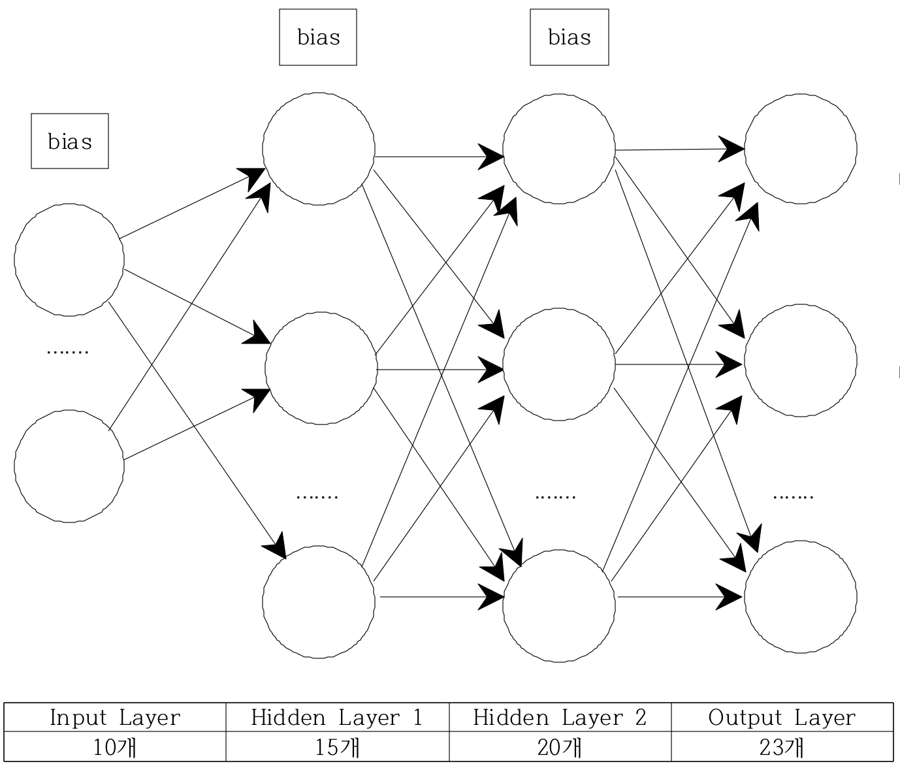
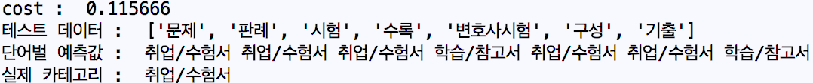
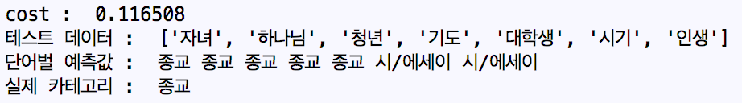
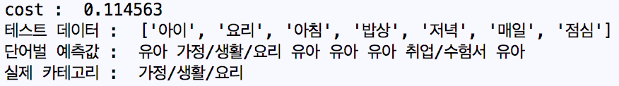
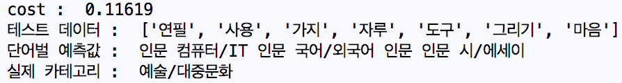

# BookCategory

## Intro

* 책 제목, 책 소개, 출판사 서평을 크롤링한다.
* 크롤링된 데이터를 TensorFlow를 이용해 학습하여 카테고리를 분류한다.


## 주요 라이브러리

- BeautifulSoup
- KoNLPy
- Scikit-Learn LabelEncoder
- Word2Vec
- TensorFlow


## 프로젝트 설명

- Naver Books 크롤링하여 957개의 Data를 Trainning / Test Set으로 활용한다.
- KoNLPy의 Twitter 이용하여 문장을 토큰화한다.
- 토큰화된 단어중 빈도수가 높은 7개의 단어를 추출한다.
- Word2Vec을 이용하여 단어별로 10차원 벡터화를 진행한다.
- LabelEncoder를 이용하여 One-hot 방식으로 변경한다
- 간단한 Neural Network를 이용하여 학습 후 테스트 작업을 거친다.


## Data Info

* BeautifulSoup을 이용해 저장된 Data Set

| Category | Count |
| :------: | :---: |
| 가정/생활/요리 |  21   |
|    건강    |   9   |
|  경제/경영   |  48   |
|  과학/공학   |  30   |
|  국어/외국어  |  36   |
|    만화    |  13   |
|    사전    |   3   |
|    사회    |  32   |
|    소설    |  90   |
|  시/에세이   |  65   |
|   어린이    |  52   |
|  여행/지도   |  17   |
|  역사/문화   |  19   |
| 예술/대중문화  |  35   |
|    유아    |  57   |
|    인문    |  52   |
|   자기계발   |  25   |
|    잡지    |  19   |
|    종교    |  81   |
|   청소년    |   1   |
|  취미/레저   |  11   |
|  취업/수험서  |  112  |
|  컴퓨터/IT  |  26   |
|  학습/참고서  |  103  |


## 토큰화 및 벡터화

1. Twitter를 이용하여 문장중 Noun형태만 찾아 배열에 저장한다.
2. 배열값에서 빈도수가 높은 7개의 단어 추출한다.
3. Word2Vec을 이용하여 각 단어별 10차원 벡터값으로 변환한다. (최종 입력 데이터 = 책의 갯수 * 10)
4. Category를 one-hot 방식으로 변경한다.

```
# TensorFlow에 전달되는 값
x_data   : 10차원 벡터값으로 변환된 빈도수 1-7위 단어
y_data   : One-hot 기법을 통해 변환된 Category
```


## TensorFlow Neural Network 구조

+ Hidden Layer 2개와 AdamOptimizer를 이용하여 학습시킨다.




## 실행결과

+ 비교적 데이터 수가 많고, 카테고리별 겹치는 단어가 많을 수록 정확도가 높다.






+ 반면, 데이터 수가 적거나, 학습되는 단어가 여러가지일 경우 잘못된 예측을 하기도 한다.




